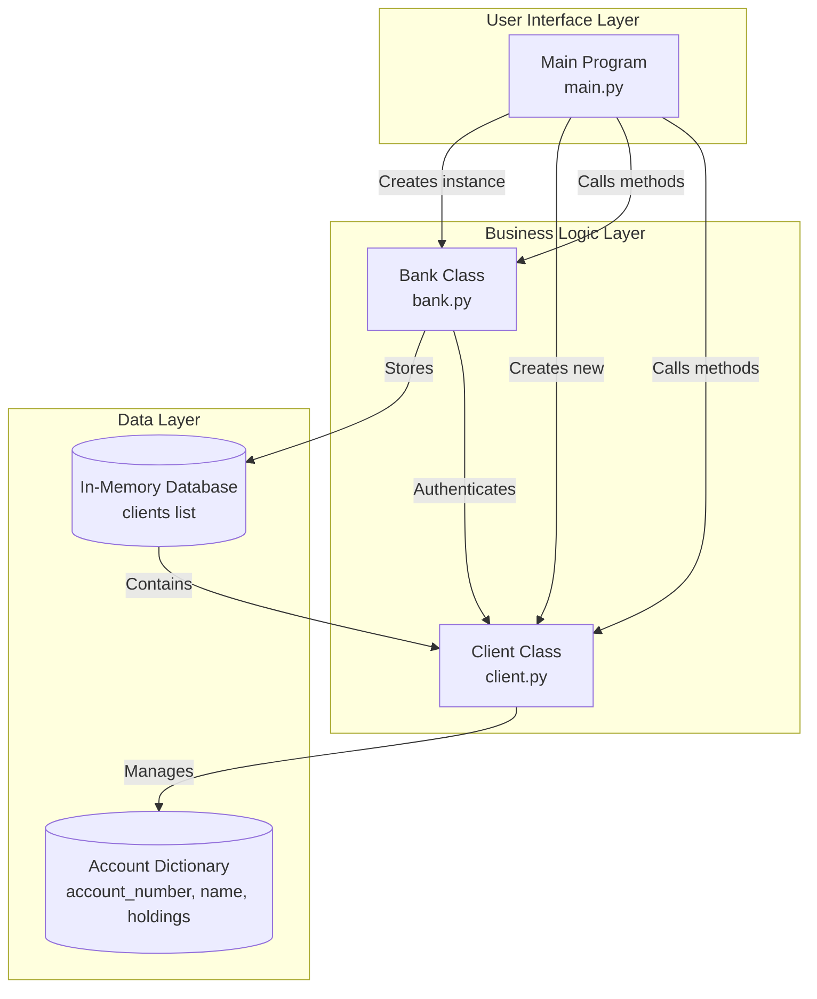
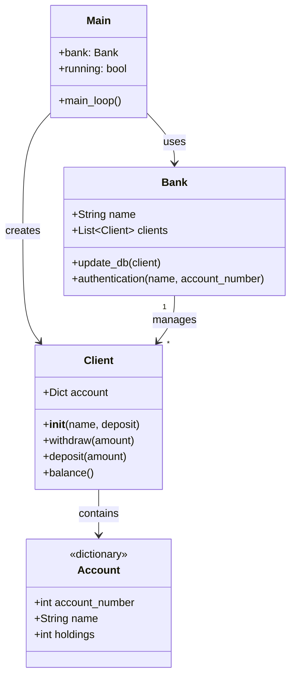
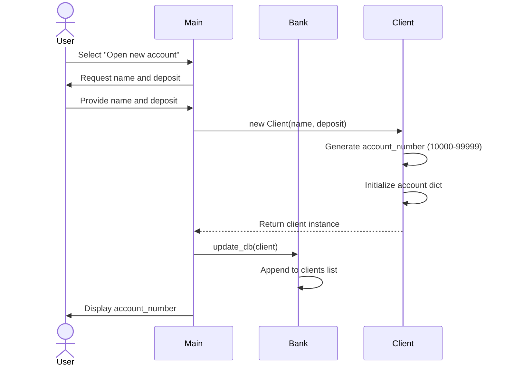
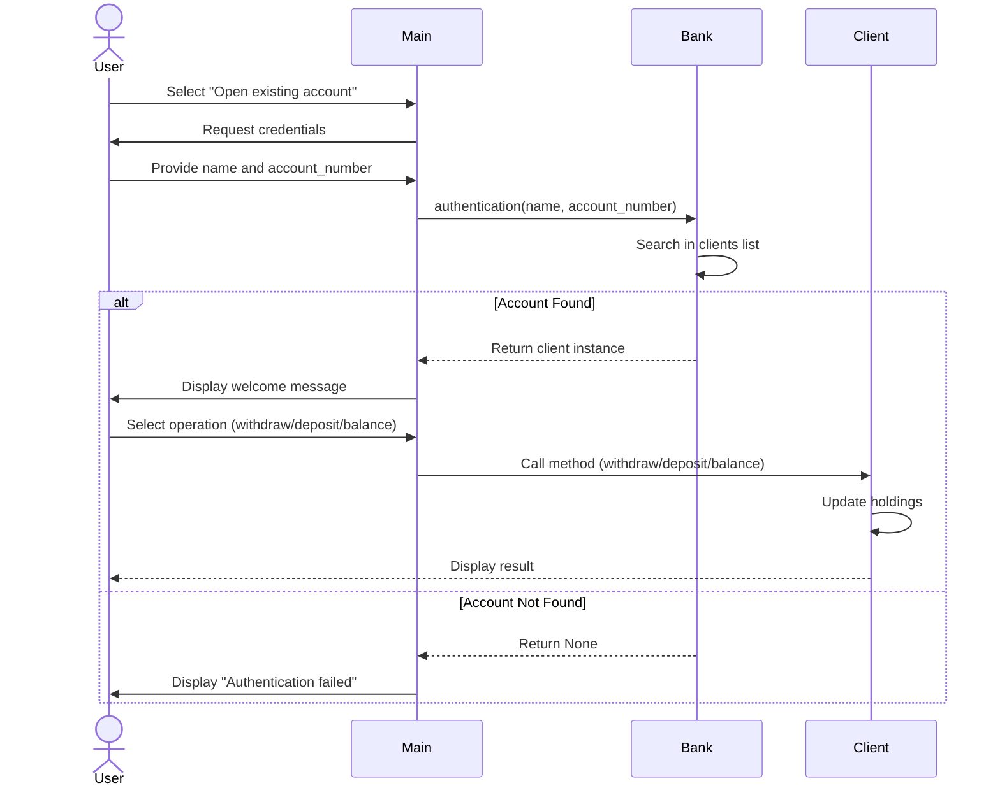
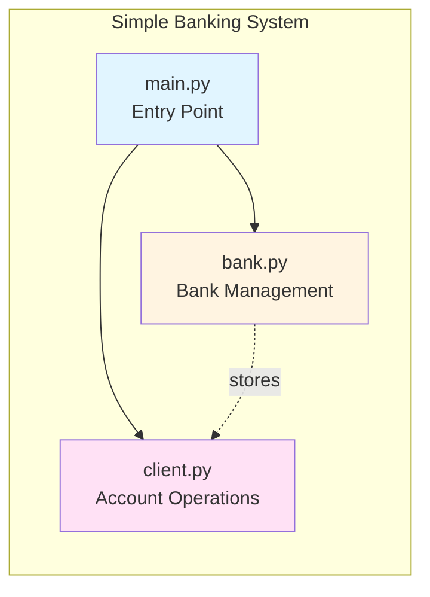
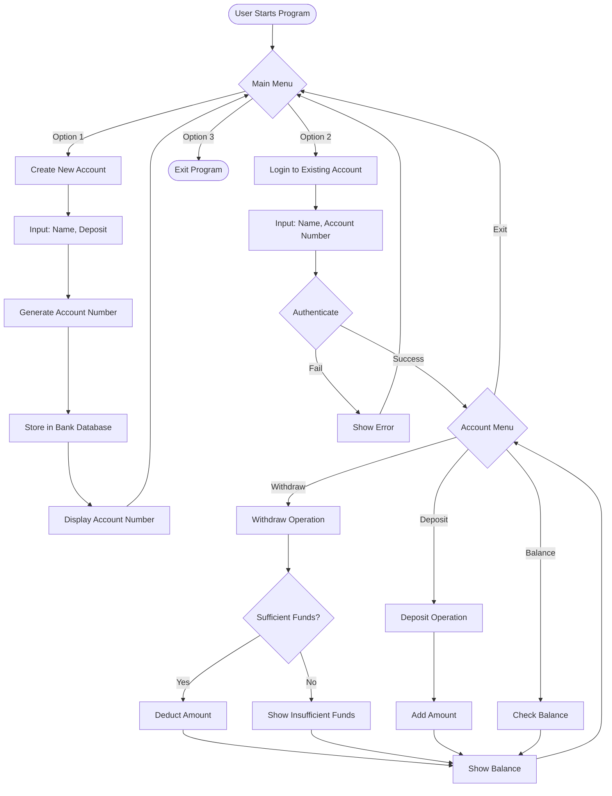
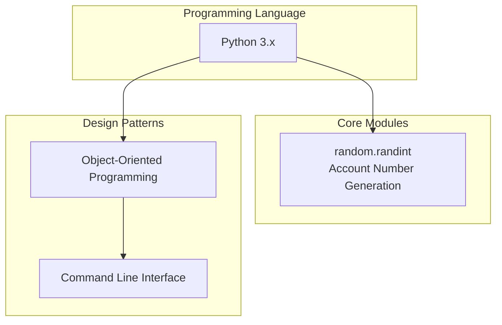

# Simple Banking System - Architecture Diagram

## System Architecture Overview

## Class Diagram

## Sequence Diagram - Create Account Flow

## Sequence Diagram - Authentication & Transaction Flow

## Component Architecture

## Data Flow Diagram

## Technology Stack

## Key Features

1. **Account Management**
   - Create new bank accounts with unique 5-digit account numbers
   - Automatic account number generation (10000-99999)
   - Initial deposit requirement

2. **Authentication**
   - Name and account number based authentication
   - Secure account access

3. **Banking Operations**
   - Withdraw funds (with balance validation)
   - Deposit funds
   - Check account balance

4. **Data Storage**
   - In-memory database using Python lists
   - Account information stored in dictionaries

## Architecture Characteristics

- **Pattern**: Layered Architecture
- **Paradigm**: Object-Oriented Programming
- **Interface**: Command Line Interface (CLI)
- **Data Storage**: In-Memory (List of Dictionaries)
- **Authentication**: Simple credential matching
- **State Management**: Instance-based state in Client objects
